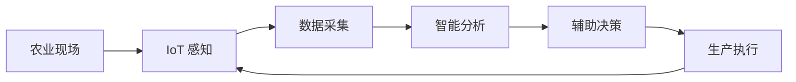

# 🌱 慧种智农

## 基于 BT + IT 融合的农业全产业链数智赋能平台

<p align="center">
  <b>物联网 · 人工智能 · 大数据 · 数字孪生 · 区块链 · 农业全产业链</b>
</p>

<p align="center">
  面向农业生产全过程，构建“感知—分析—决策—执行”的数智化闭环，
  打通农资、生产、植保、溯源、营销、供应链与资源回收等业务环节。
</p>

---

## 📖 项目简介

**慧种智农**是一个面向农业生产与农业全产业链管理的数智化平台。

项目围绕农业生产过程中产生的环境、设备、作物、农事、农资、病虫害、产品、物流和营销等多源数据，融合 **IoT、AI、大数据、数字孪生、区块链及移动互联网** 等技术，为农业生产经营主体提供从生产感知、智能分析到产业链管理的一体化服务。

平台总体形成：

```text
农业现场感知
      ↓
多源数据采集
      ↓
智能分析
      ↓
辅助决策
      ↓
生产执行
      ↓
产品溯源
      ↓
仓储物流
      ↓
营销销售
      ↓
消费者
```

实现农业生产与产业链数据的持续贯通。

---

## ✨ 核心功能

| 模块 | 功能说明 |
|---|---|
| 🛒 农资交易 | 种子、肥料、农药、农膜、农机等农资管理、采购、订单与库存 |
| 🌡️ 智慧物联 | 农业环境监测、设备管理、实时数据采集、异常预警与远程控制 |
| 🐛 病虫害检测 | 基于农业图像与 AI 模型进行病虫害辅助识别与风险分析 |
| 🌐 数字孪生 | 农业基地三维映射、实时数据展示及生产方案仿真 |
| 👨‍🌾 智慧专家 | “AI 初筛 + 专家复诊”的农业智能咨询服务 |
| 🔍 产品溯源 | 产品批次、农事、质量、仓储、物流及二维码全过程追溯 |
| 📈 智慧营销 | 农产品展示、推荐、营销活动、在线交易及销售分析 |
| 🚚 供应链服务 | 供应商、仓储、库存、物流订单及运输轨迹管理 |
| ♻️ 废资利用 | 农业废弃资源回收预约、回收匹配、奖励及电子台账 |
| 🤝 合伙人门户 | 合作主体、资质、合作类型及合作状态管理 |

---

## 🏗️ 系统架构

平台采用分层、模块化设计，总体划分为七个层次：

```text
┌─────────────────────────────────────┐
│               展现层                │
│       Web / 移动端 / 可视化大屏      │
├─────────────────────────────────────┤
│             业务应用层              │
│ 农资 | 物联 | AI | 溯源 | 营销 | 供应链 │
├─────────────────────────────────────┤
│               平台层                │
│ 用户 | 权限 | IoT | AI | 数据 | 区块链 │
├─────────────────────────────────────┤
│              数据源层               │
│ 生产 | 环境 | 设备 | 交易 | 产品 | 物流 │
├─────────────────────────────────────┤
│               支撑层                │
│       数据库 | 缓存 | 文件存储       │
├─────────────────────────────────────┤
│               传输层                │
│        Internet | 5G | MQTT         │
├─────────────────────────────────────┤
│               感知层                │
│ 传感器 | 摄像头 | 气象设备 | 无人机   │
└─────────────────────────────────────┘
```

---

## 🔄 核心业务闭环

### 🌾 智慧农业生产



通过传感器、摄像头及农业设备持续获取生产数据，实现：

> **感知 → 分析 → 决策 → 执行**

的农业生产闭环。

### 🐛 病虫害智能诊断


采用 **AI 初筛 + 专家复诊** 的协同模式，提高农业问题处理效率。

### 🔍 农产品全流程溯源


以**产品批次**为核心，将生产、质量、仓储、物流和销售数据关联起来，实现从生产端到消费端的全过程信息查询。

---

## 🌡️ 智慧物联

平台通过农业传感器及现场设备采集：

- 空气温度 / 湿度
- 土壤温度 / 湿度
- 光照强度
- 降雨量
- 风速 / 风向
- EC
- 土壤养分
- 作物图像
- 设备运行状态

典型数据链路：

```text
传感器
   ↓
现场设备 / IoT 网关
   ↓
5G / Internet / MQTT
   ↓
IoT 接入服务
   ↓
数据解析与校验
   ↓
数据存储
   ↓
实时监测
   ↓
异常预警
```

对于灌溉、施肥等可控设备，可进一步支持远程控制及操作记录。

---

## 🤖 AI + 农业

AI 能力主要应用于：

- 🌿 作物图像分析
- 🐛 病虫害辅助识别
- ⚠️ 农业风险分析
- 👨‍🌾 智慧专家辅助诊断
- 🛒 商品推荐
- 🚚 供应链数据分析

病虫害识别流程：

```text
作物图像
   ↓
图像处理
   ↓
AI 模型
   ↓
病虫害识别
   ↓
置信度 / 风险信息
   ↓
专家复核
   ↓
农业生产建议
```

---

## 🌐 数字孪生

平台通过数字孪生技术建立真实农业基地与数字空间之间的映射：

```text
真实农业基地
      ↓
IoT 实时数据
      ↓
数据服务
      ↓
数字孪生模型
      ↓
三维可视化
      ↓
模拟与方案评估
```

用于展示农业基地、地块、设备和环境状态，并为农业生产方案分析提供支持。

---

## 🔗 区块链 + 产品溯源

平台围绕产品批次组织溯源数据：

```text
生产主体
   ↓
农业基地
   ↓
生产地块
   ↓
种植与农事记录
   ↓
采收
   ↓
质量信息
   ↓
仓储物流
   ↓
销售
   ↓
二维码溯源
```

关键业务信息可通过数据摘要和区块链服务进行可信存证。

消费者扫描二维码后，可查询产品相关生产及流通过程信息。

---

## 💾 数据体系

平台核心数据主要包括：

```text
用户与权限
├── 用户
├── 角色
└── 权限

农业基础
├── 组织
├── 基地
├── 地块
├── 作物
└── 品种

智慧物联
├── IoT设备
├── 传感器
├── 环境数据
└── 设备控制记录

农业生产
├── 农事记录
├── 病虫害检测
└── 预警记录

产业链
├── 农资
├── 订单
├── 库存
├── 产品批次
├── 产品溯源
├── 仓储
├── 物流
└── 营销

智能服务
├── AI模型
├── 专家咨询
├── 数字孪生
└── 区块链存证
```

核心数据关系：

```text
组织
 ↓
农业基地
 ↓
地块
 ├──────────────┐
 ↓              ↓
作物           IoT设备
 ↓              ↓
农事记录       传感器
 ↓              ↓
产品批次       环境数据
 ↓
溯源记录
 ↓
二维码
 ↓
消费者
```

---

## 🖥️ 软件界面

建议在仓库中建立：

```text
docs/
└── images/
    ├── login.png
    ├── dashboard.png
    ├── workspace.png
    ├── management.png
    └── qrcode.png
```

然后在 README 中展示实际软件截图：

```html
<p align="center">
  
</p>
```

### 系统首页

```html
<p align="center">
  
</p>
```

### 二维码功能

```html
<p align="center">
  
</p>
```

> 建议这里全部替换成项目现有的软件真实截图，不要使用概念图。

---

## 🚀 部署架构

推荐的逻辑部署方式：

```text
                    用户
                     │
                  HTTPS
                     ↓
             ┌────────────┐
             │   Nginx    │
             └─────┬──────┘
                   ↓
             后端业务服务
                   │
       ┌───────────┼───────────┐
       ↓           ↓           ↓
     MySQL       Redis       文件存储
       │
   ┌───┴─────────────┐
   ↓                 ↓
 IoT服务           AI服务
   │                 │
现场设备           AI模型

       后端业务服务
             │
      ┌──────┴──────┐
      ↓             ↓
  区块链服务     数字孪生服务
```

---

## ⚙️ 环境建议

| 环境 | 建议 |
|---|---|
| OS | Ubuntu Server 22.04 LTS 或实际服务器系统 |
| Database | MySQL 8.0 |
| Cache | Redis 7.x |
| Web Server | Nginx |
| Java | JDK 17（如后端采用 Java） |
| Python | Python 3.10+（AI 服务） |
| Node.js | Node.js 18/20 LTS（如前端需要） |
| IoT | MQTT 或项目实际通信协议 |

> 上述内容属于推荐环境。仓库正式公开前，应根据项目实际代码和部署环境修改。

---

## 📦 快速开始

### 1. 克隆项目

```bash
git clone <your-repository-url>
cd <your-project-directory>
```

### 2. 初始化数据库

创建数据库：

```sql
CREATE DATABASE smart_agriculture
DEFAULT CHARACTER SET utf8mb4
COLLATE utf8mb4_unicode_ci;
```

随后根据项目实际 SQL 文件初始化数据库。

### 3. 配置应用

配置数据库、Redis、文件存储以及其他服务连接信息。

建议通过环境变量保存敏感配置：

```env
DB_HOST=127.0.0.1
DB_PORT=3306
DB_NAME=smart_agriculture
DB_USERNAME=your_username
DB_PASSWORD=your_password
```

> 不要将真实数据库密码、服务器密码、API Key 或其他密钥提交到 GitHub。

### 4. 启动相关服务

建议按照：

```text
MySQL
  ↓
Redis
  ↓
IoT / AI 等基础服务
  ↓
后端服务
  ↓
前端服务 / Nginx
```

的顺序启动。

具体启动命令以仓库实际代码为准。

---

## 📂 推荐项目结构

```text
Smart-Agriculture/
│
├── frontend/                 # 前端
├── backend/                  # 后端
├── ai/                       # AI服务
├── database/                 # 数据库脚本
├── docs/                     # 项目文档
│   ├── images/               # README及说明书图片
│   ├── requirements/         # 需求文档
│   ├── design/               # 设计文档
│   ├── deployment/           # 部署文档
│   └── testing/              # 测试文档
│
├── scripts/                  # 部署/维护脚本
├── .gitignore
├── LICENSE
└── README.md
```

目录结构应根据真实仓库调整。

---

## 📚 项目文档

目前项目配套材料包括：

- 📘 需求分析说明书
- 📗 概要设计说明书
- 📙 数据库设计说明书
- 📕 安装部署说明书
- 🧪 系统测试说明书
- 📝 软件使用说明书
- 🎬 软件演示文档
- 📅 项目工作计划
- 📋 项目会议纪要
- 📊 项目工作总结

建议统一放入：

```text
docs/
```

目录，方便项目开发、部署和验收过程中查询。

---

## 🔐 安全说明

部署和使用过程中请注意：

- 不要在仓库中提交数据库真实密码；
- 不要提交服务器账号密码；
- 不要提交 API Key、Token 或私钥；
- 用户密码应采用安全的哈希方式保存；
- 正式环境建议启用 HTTPS；
- MySQL、Redis 等基础服务不应直接暴露公网；
- 管理功能应实施身份认证和权限控制；
- 重要业务数据应定期备份；
- 重要管理操作应保留审计日志。

推荐在 `.gitignore` 中排除：

```gitignore
.env
*.key
*.pem
application-prod.yml
config/secrets.*
logs/
uploads/
backup/
```

---

## 🗺️ Roadmap

- [x] 项目需求分析
- [x] 系统总体设计
- [x] 数据库设计
- [x] 安装部署方案
- [x] 系统测试方案
- [x] 软件使用说明
- [x] 软件演示方案
- [ ] 核心业务代码与文档最终核对
- [ ] IoT 真实设备联调
- [ ] AI 服务联调
- [ ] 完整系统测试
- [ ] 性能与安全测试
- [ ] 正式环境部署
- [ ] 项目验收

> Roadmap 中的完成状态应根据项目实际进度及时更新。

---

## 📄 软件信息

**项目名称：** 慧种智农——基于 BT+IT 融合的农业全产业链数智赋能平台

项目现有支撑材料中包含：

**基于路径优化算法的农业安全溯源平台 V1.0**

相关软件系统截图及软件著作权材料可作为项目软件成果支撑。

---

## 🤝 Contributors

感谢所有参与项目需求分析、系统设计、软件开发、数据建设、测试部署及项目材料整理的成员。

可根据实际团队补充：

```text
Project Lead:
Frontend:
Backend:
AI:
IoT:
Database:
Digital Twin:
Testing:
Documentation:
```

---

## 📜 License

本项目的源代码、数据及相关文档的使用范围以项目实际授权协议为准。

如计划将仓库公开，请在公开前补充明确的 `LICENSE` 文件，并检查仓库中是否包含敏感数据、账号、密钥或未经授权公开的数据。

---

<p align="center">
  <b>🌱 让数据贯通农业生产，让智能服务农业全产业链</b>
</p>
